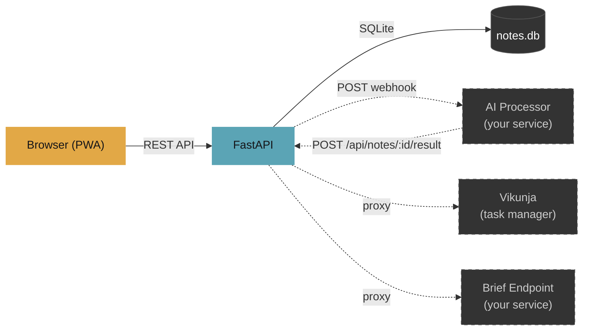
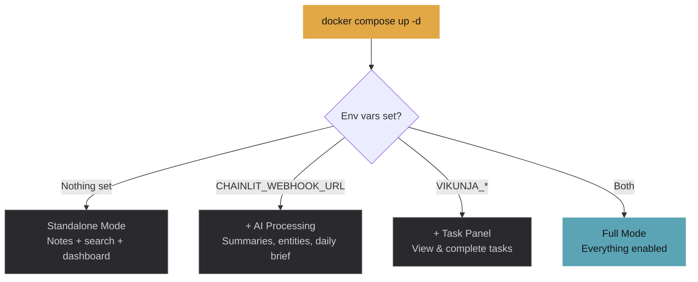
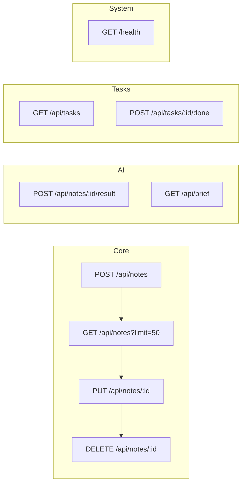

# Work Notes Capture

A fast, keyboard-driven PWA for dumping meeting notes, action items, and random thoughts into one place -- with optional AI processing and task management.

Zero-config by default. Notes save to SQLite. Plug in a webhook and a task manager if you want superpowers.


---

## Architecture



Solid lines = always active. Dashed = optional integrations you enable via env vars.

---

## Features

| Feature | Needs setup? | Description |
|---------|:---:|-------------|
| Note capture | No | Write notes with meeting context, project tags, priority levels |
| Search & filter | No | `tag:blocker`, `project:api`, `priority:high`, or free text |
| Edit & delete | No | Click to expand, edit or delete any note |
| Mini dashboard | No | Activity chart, project breakdown, tag distribution (click to cycle) |
| Keyboard shortcuts | No | `Ctrl+Enter` capture, `/` search, `n` new note, `?` help |
| PWA install | No | Add to home screen on mobile or desktop |
| AI processing | Webhook | Send notes to any service for summarization and entity extraction |
| Task panel | Vikunja | View, complete, and link tasks from sidebar |
| Daily brief | Webhook | AI-generated summary of your day's work |

---

## Quick Start

### Docker (recommended)

```bash
git clone https://github.com/2incertus/work-notes-capture.git
cd work-notes-capture
cp .env.example .env
docker compose up -d
```

Open [http://localhost:8310](http://localhost:8310).

That's it. Notes save to `./data/notes.db`. No external dependencies.

### Without Docker

```bash
git clone https://github.com/2incertus/work-notes-capture.git
cd work-notes-capture
python3 -m venv .venv && source .venv/bin/activate
pip install -r requirements.txt
mkdir -p /data  # or set DB path in code
uvicorn app:app --host 0.0.0.0 --port 8000
```

Open [http://localhost:8000](http://localhost:8000).

> **Note:** When running without Docker, the database path defaults to `/data/notes.db`. You can change `DB_PATH` in `app.py` to something like `./data/notes.db` if you prefer a relative path.

---

## Configuration

All configuration is through environment variables. Copy `.env.example` to `.env` and edit:

```bash
# AI processing webhook (optional)
# Set to your endpoint, or leave empty to disable
CHAINLIT_WEBHOOK_URL=

# Vikunja task manager (optional)
# Get your token from Vikunja > Settings > API Tokens
VIKUNJA_URL=http://localhost:3456
VIKUNJA_TOKEN=
```

### Running modes



---

## Optional Integrations

### AI Processing Webhook

Set `CHAINLIT_WEBHOOK_URL` to any HTTP endpoint. On every note capture, the app sends a POST:

```json
{
  "note_id": 42,
  "content": "Sprint planning: agreed to migrate auth to OAuth2...",
  "tags": ["meeting", "decision"],
  "meeting": "Sprint Planning",
  "project": "Backend",
  "priority": "medium"
}
```

Your service processes this however you want (LLM summarization, entity extraction, task creation) and calls back:

```
POST /api/notes/42/result
```

```json
{
  "summary": "Sprint planning decided on OAuth2 migration...",
  "tasks_created": 2,
  "knowledge_items": 1,
  "entities": ["Alice", "Bob", "Sprint 14"]
}
```

The summary appears inline on the note card. If `tasks_created > 0` and you're using Vikunja, the app links matching tasks to the note automatically.

**You can use any backend for this** -- a simple Flask app with an LLM call, an n8n workflow, a Lambda function, whatever accepts JSON and calls back.

### Vikunja (Task Management)

[Vikunja](https://vikunja.io/) is an open-source task manager. Set `VIKUNJA_URL` and `VIKUNJA_TOKEN` to enable:

- Sidebar panel showing tasks across all your projects
- Mark tasks complete directly from the UI
- Linked tasks appear inline on note cards when expanded
- Click a task to highlight the source note

**Getting your Vikunja API token:**

1. Open your Vikunja instance
2. Go to Settings > API Tokens
3. Create a new token with read/write access
4. Paste it as `VIKUNJA_TOKEN` in your `.env`

> You can swap Vikunja for any task manager by modifying the `/api/tasks` proxy in `app.py`. The frontend just expects `{tasks: [{id, title, done, due_date, project, ...}]}`.

### Daily Brief

The brief panel calls your AI webhook's sibling `/brief` endpoint. It expects:

```json
{
  "brief": {
    "summary": "Productive day. 8 notes captured across 3 projects...",
    "decisions": ["Chose OAuth2 over SAML for auth migration"],
    "tomorrow_priorities": ["Finalize API spec", "Review PRs"],
    "stalled": ["Waiting on design review for dashboard"],
    "patterns": ["Most notes captured during morning standup"],
    "stats": { "notes_captured": 8, "tasks_created": 3, "knowledge_items": 2 }
  }
}
```

---

## API Reference

All endpoints return JSON.



| Method | Path | Description | Auth |
|--------|------|-------------|------|
| `POST` | `/api/notes` | Create a note | -- |
| `GET` | `/api/notes?limit=50` | List notes, newest first | -- |
| `PUT` | `/api/notes/:id` | Update note content, tags, project, etc. | -- |
| `DELETE` | `/api/notes/:id` | Delete a note | -- |
| `POST` | `/api/notes/:id/result` | Store AI processing result for a note | -- |
| `GET` | `/api/tasks` | List Vikunja tasks (proxied) | Vikunja token |
| `POST` | `/api/tasks/:id/done` | Toggle task completion (proxied) | Vikunja token |
| `GET` | `/api/brief` | Get daily brief from AI service | Webhook |
| `GET` | `/health` | Health check | -- |

### Create note payload

```json
{
  "content": "Note text here (required)",
  "tags": ["meeting", "action-item"],
  "meeting": "Sprint Planning",
  "project": "Backend",
  "priority": "medium"
}
```

`tags` can include any string. The UI provides quick-select for: `meeting`, `action-item`, `decision`, `idea`, `blocker`, `status`.

`priority` is one of: `low` (default), `medium`, `high`.

---

## Search Syntax

The search bar supports structured queries:

| Query | What it finds |
|-------|---------------|
| `oauth migration` | Free text search across note content |
| `tag:blocker` | Notes tagged "blocker" |
| `project:backend` | Notes in the "backend" project |
| `priority:high` | High priority notes |
| `tag:decision oauth` | Combine structured + free text |

---

## Keyboard Shortcuts

| Key | Action |
|-----|--------|
| `Ctrl+Enter` | Capture note |
| `/` | Focus search |
| `n` | New note (focus textarea) |
| `Esc` | Clear search / close modal |
| `?` | Toggle shortcut help |

---

## Design

"Warm Terminal + Arc" -- dark theme with amber and teal accents, JetBrains Mono for headings, Inter for body text. Each project gets its own generated color for visual grouping.

Micro-animations on capture, task completion, stat updates, and card expansion. Typing indicator while composing. Rotating greetings and capture confirmations for personality.

---

## Tech Stack

| Layer | Technology |
|-------|-----------|
| Backend | Python 3.12 / FastAPI / aiosqlite |
| Frontend | Vanilla JS, CSS custom properties, Canvas API |
| Storage | SQLite (zero config, file-based) |
| Container | Python 3.12-slim, single Dockerfile |
| HTTP client | httpx (async, for webhook + Vikunja proxy) |

No build step. No bundler. No node_modules. Just HTML, CSS, and JS served by FastAPI.

---

## Project Structure

```
work-notes-capture/
├── app.py              # FastAPI backend (all routes)
├── Dockerfile          # Single-stage Python build
├── docker-compose.yml  # One service, one volume
├── requirements.txt    # 4 dependencies
├── .env.example        # Configuration template
├── static/
│   ├── index.html      # PWA shell, modals, layout
│   ├── style.css       # Full theme + animations
│   ├── app.js          # All frontend logic (vanilla)
│   └── manifest.json   # PWA manifest
└── data/
    └── notes.db        # SQLite database (created on first run)
```

---

## Deploying Behind a Reverse Proxy

The app binds to port 8000 inside the container, mapped to 8310 on the host by default. To put it behind nginx, Caddy, or Cloudflare Tunnel:

**nginx:**
```nginx
location / {
    proxy_pass http://localhost:8310;
    proxy_set_header Host $host;
    proxy_set_header X-Real-IP $remote_addr;
}
```

**Caddy:**
```
notes.example.com {
    reverse_proxy localhost:8310
}
```

**Cloudflare Tunnel (cloudflared):**
```yaml
- hostname: notes.example.com
  service: http://localhost:8310
```

---

## Building Your Own AI Webhook

The simplest possible webhook that works with this app:

```python
# webhook.py -- minimal example
from fastapi import FastAPI, Request
from fastapi.responses import JSONResponse
import httpx

app = FastAPI()

@app.post("/api/work-notes/process")
async def process_note(request: Request):
    note = await request.json()

    # Your AI logic here -- call an LLM, extract entities, etc.
    summary = f"Note about {note.get('project', 'general')}: {note['content'][:100]}..."

    # Call back to Work Notes with the result
    async with httpx.AsyncClient() as client:
        await client.post(
            f"http://work-notes:8000/api/notes/{note['note_id']}/result",
            json={
                "summary": summary,
                "tasks_created": 0,
                "knowledge_items": 0,
                "entities": [],
            },
        )

    return JSONResponse({"ok": True})

@app.post("/api/work-notes/brief")
async def daily_brief():
    return JSONResponse({
        "brief": {
            "summary": "Your daily summary here.",
            "decisions": [],
            "tomorrow_priorities": [],
            "stalled": [],
            "patterns": [],
            "stats": {"notes_captured": 0, "tasks_created": 0, "knowledge_items": 0},
        }
    })
```

---

## License

MIT
